# Pertanyaan dan Tugas
1. Tambahkan Layout Untuk menu About
 * => buat layout yang berisi deskripsi,portofolio,dll

2. Tambahkan Layout untuk menu contact
 * => yang berisi form isian : nama, email, massage,dll

## jawaban 
1. 
* berikut merupakan deklarasinya :
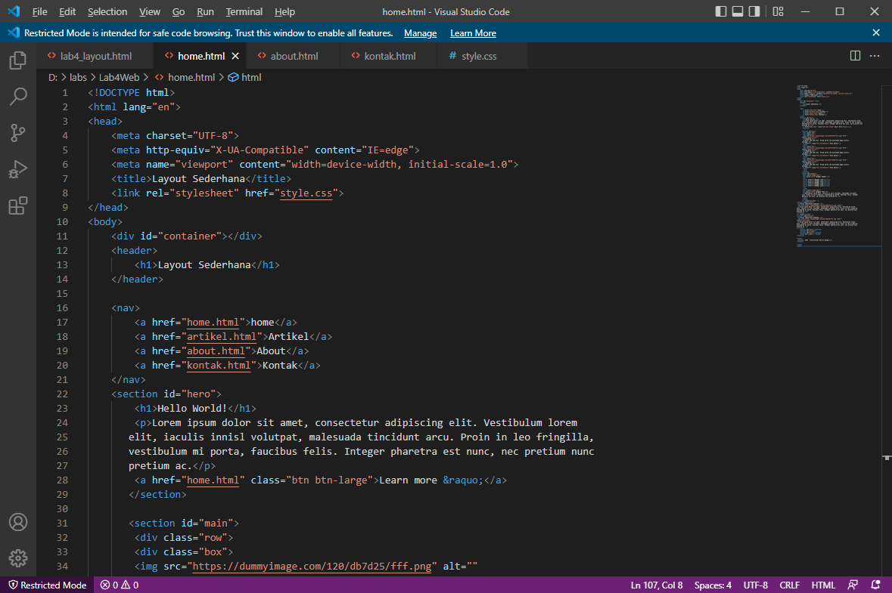

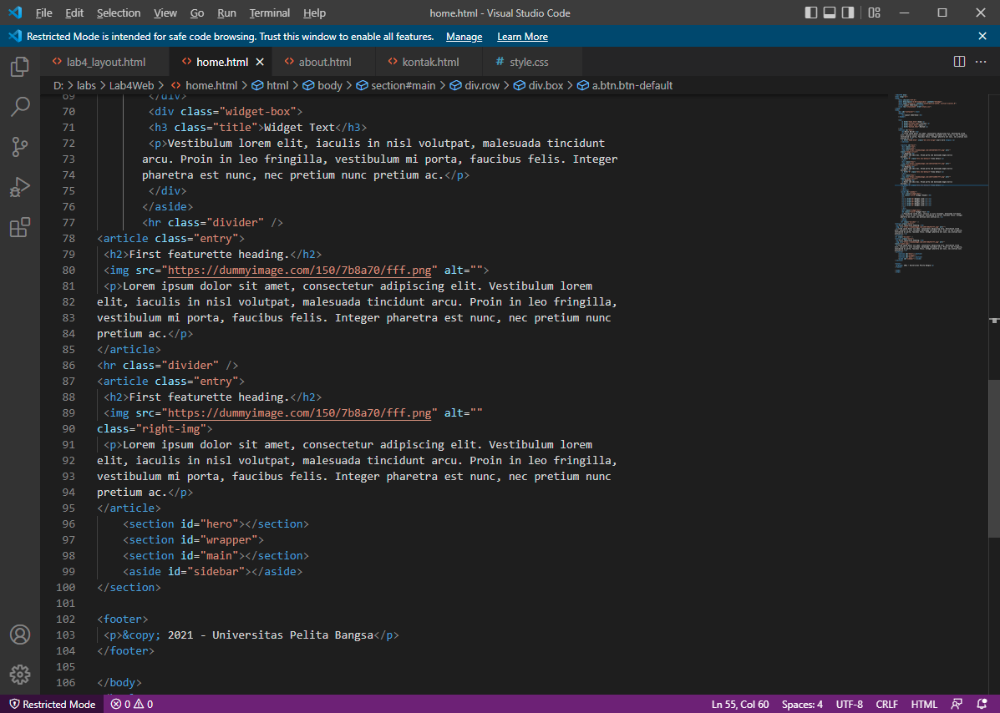

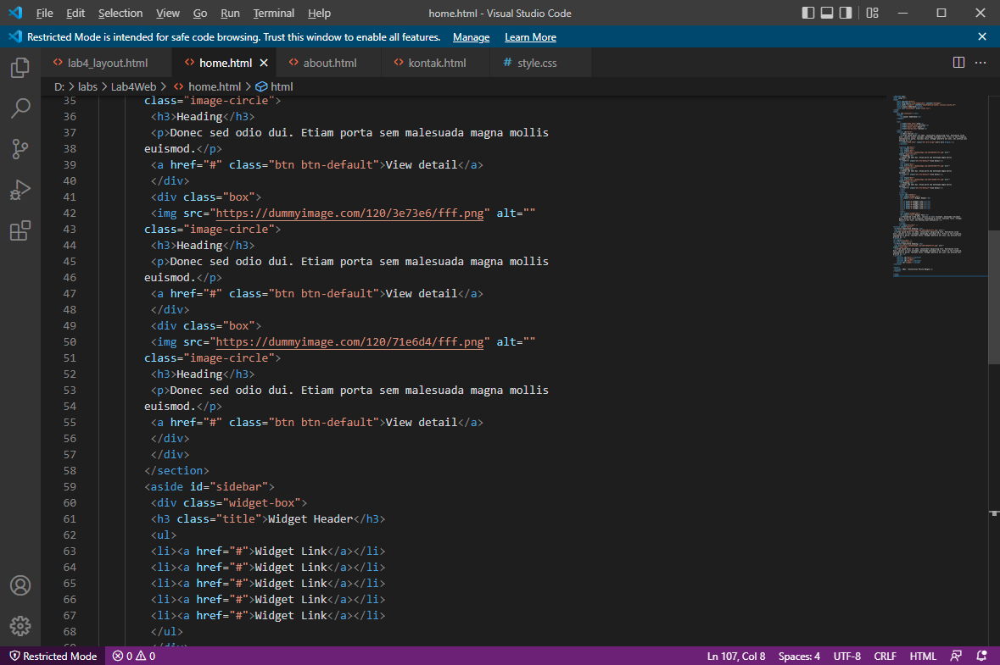

* Berikut merupakan tampian Browsernya :
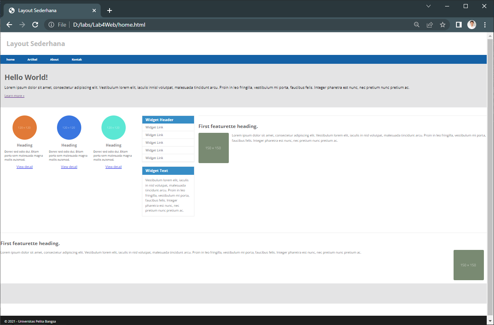

2. 
* berikut merupakan deklarasinya :
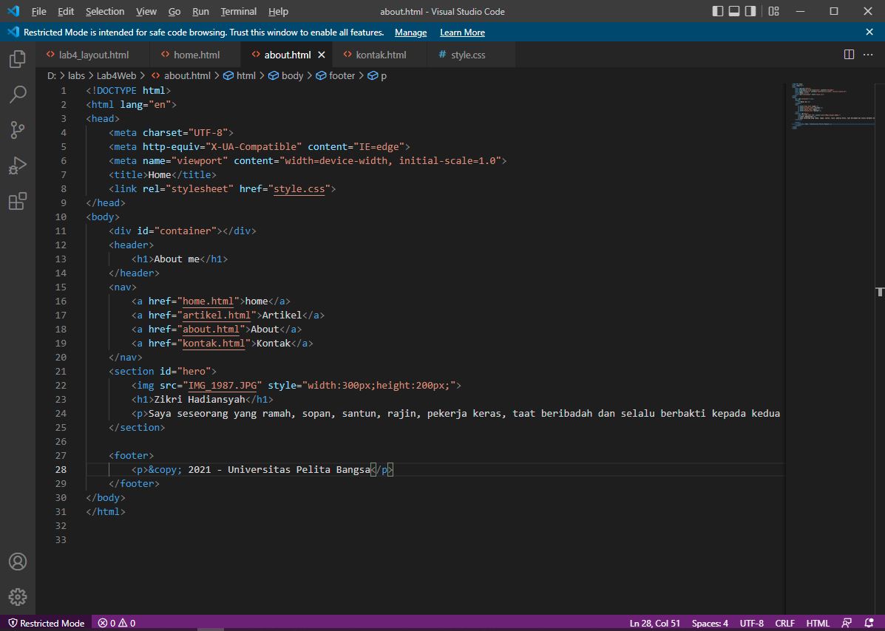

* berikut merupakan tampilan browsernya :
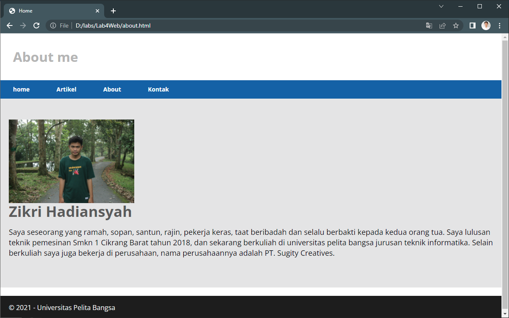

* berikut merupakan deklarasi css style nya :
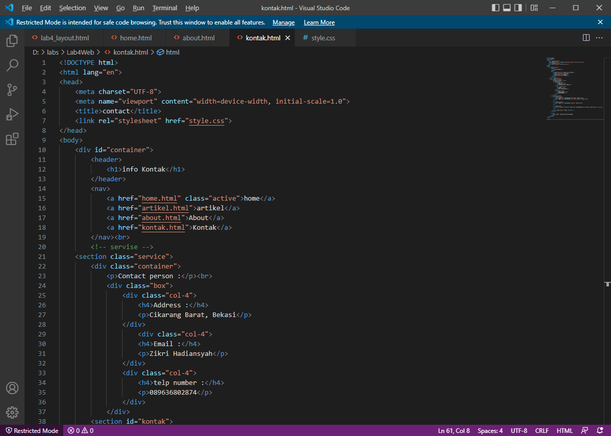

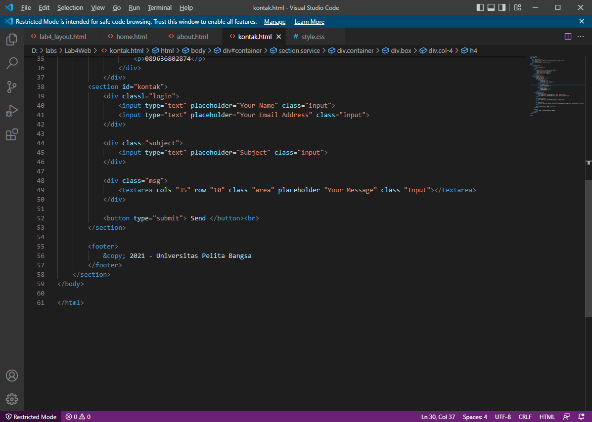

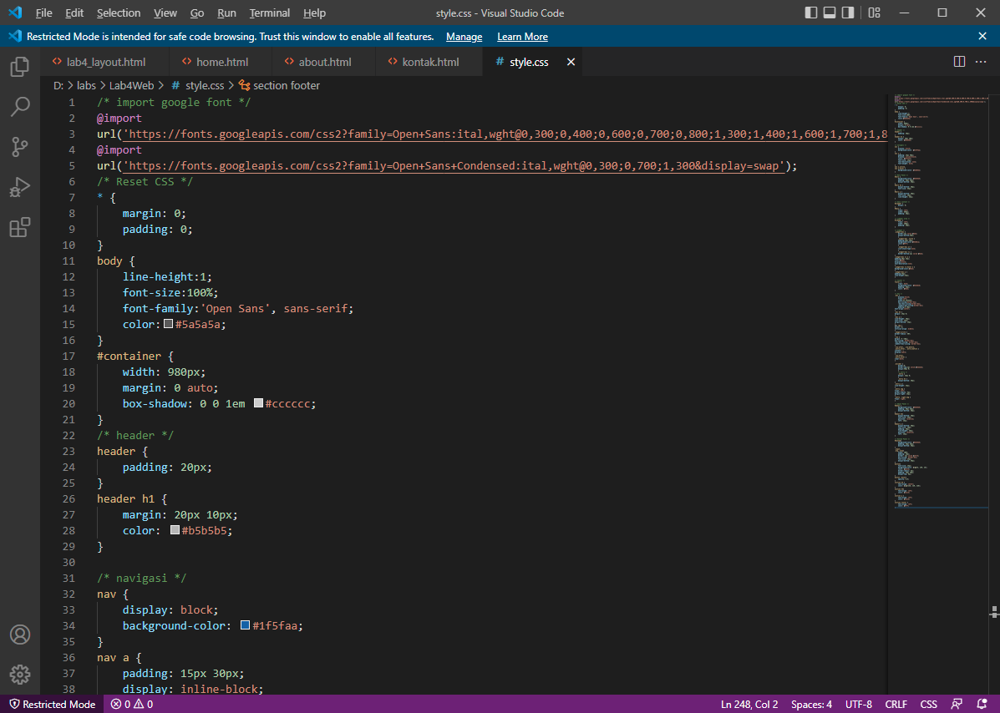

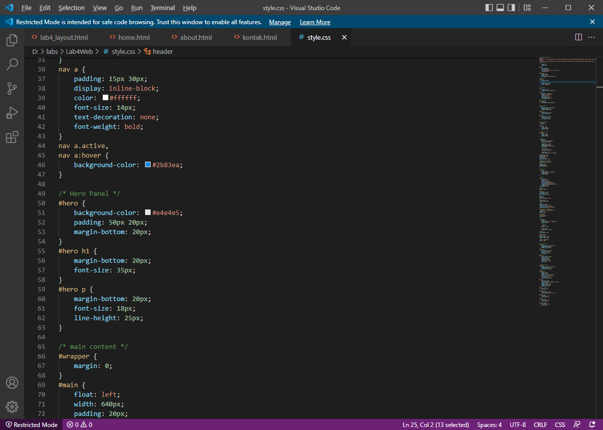

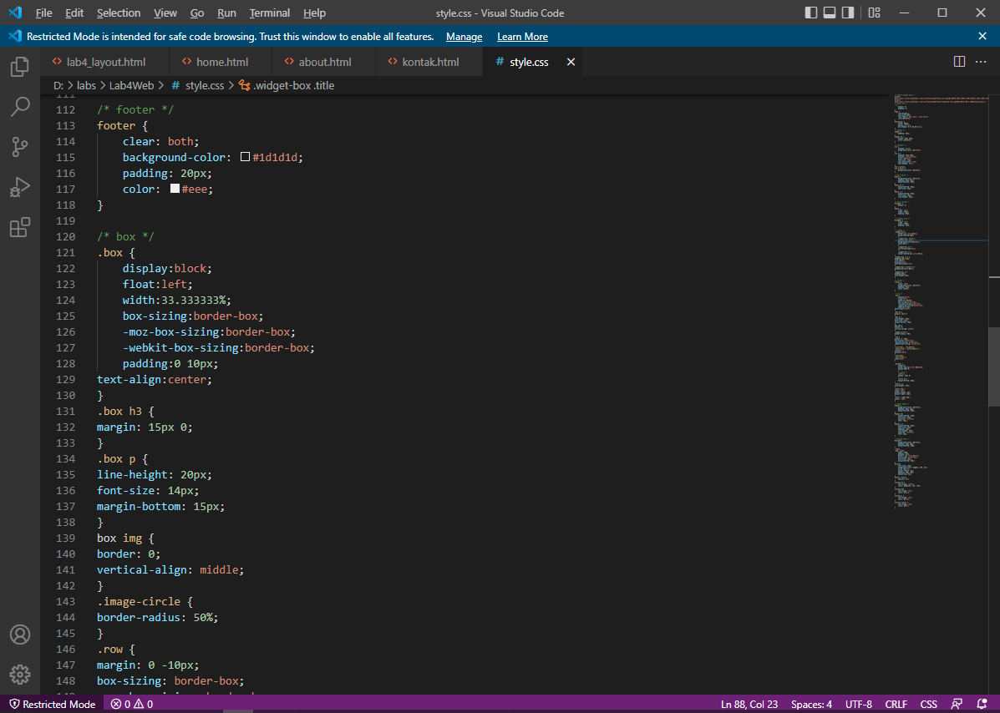

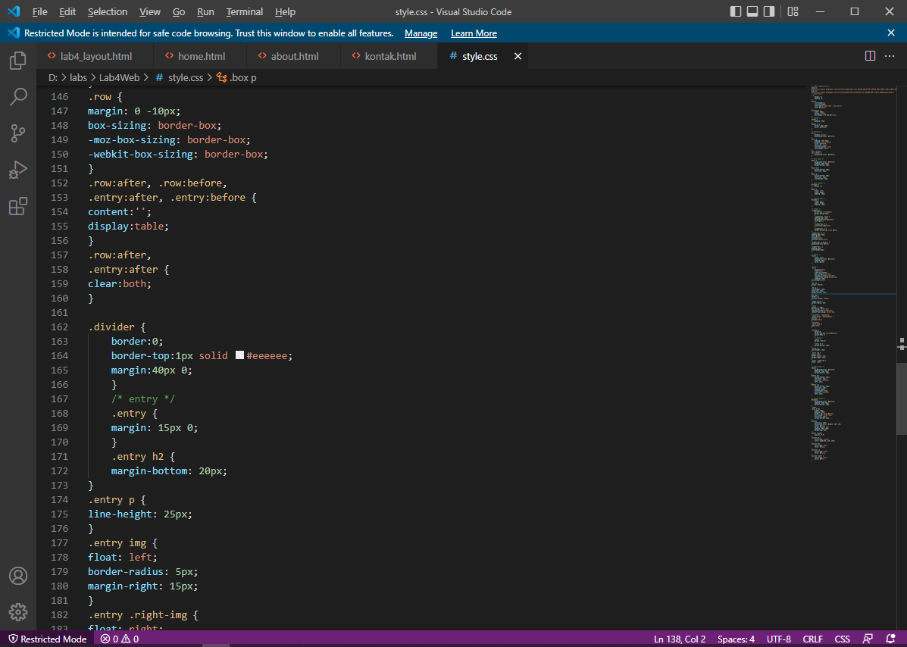

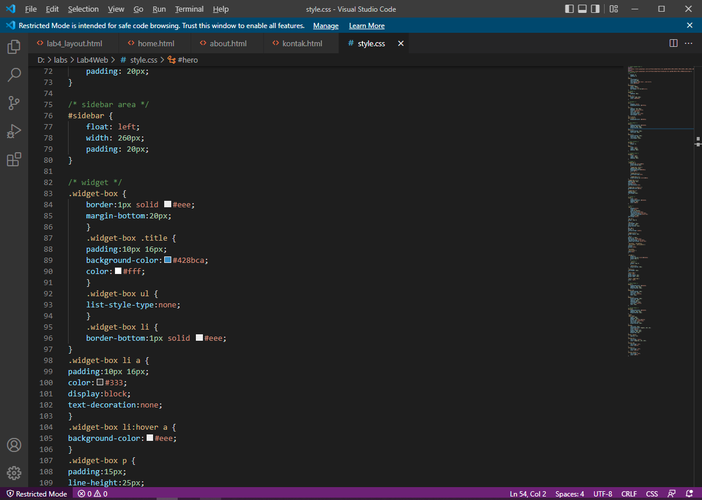

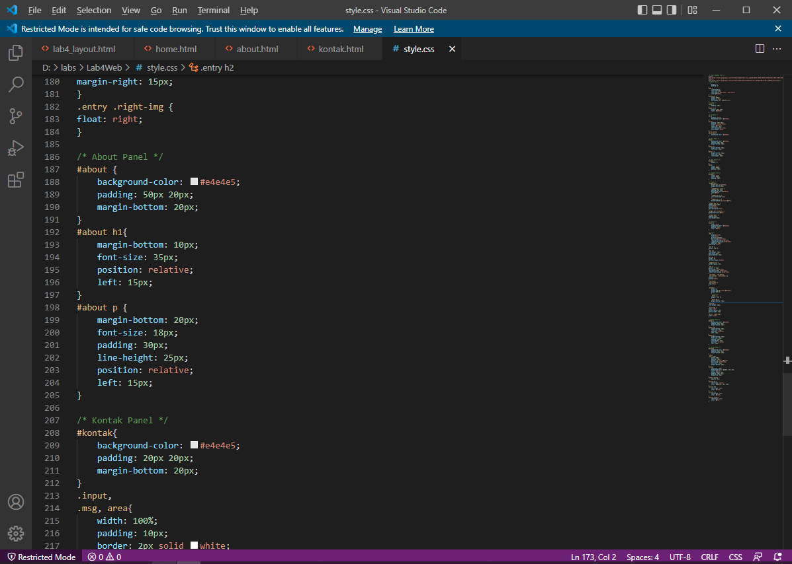

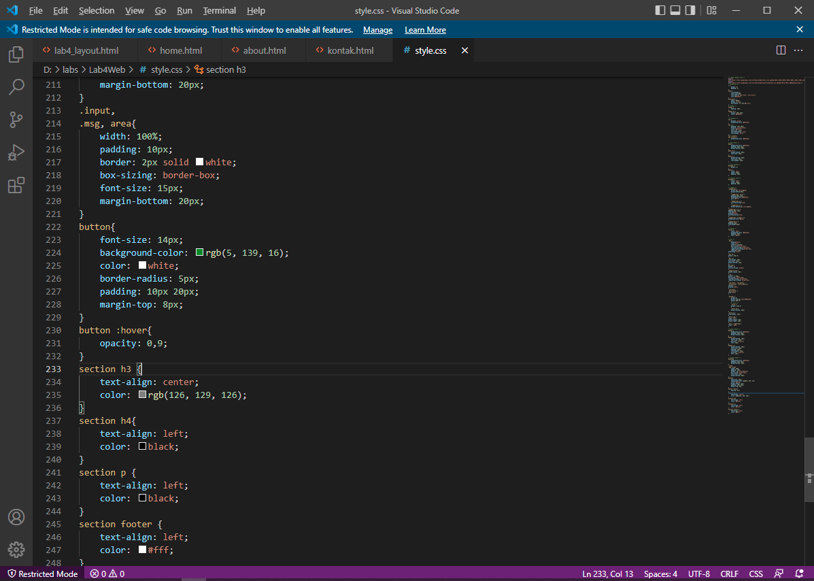

